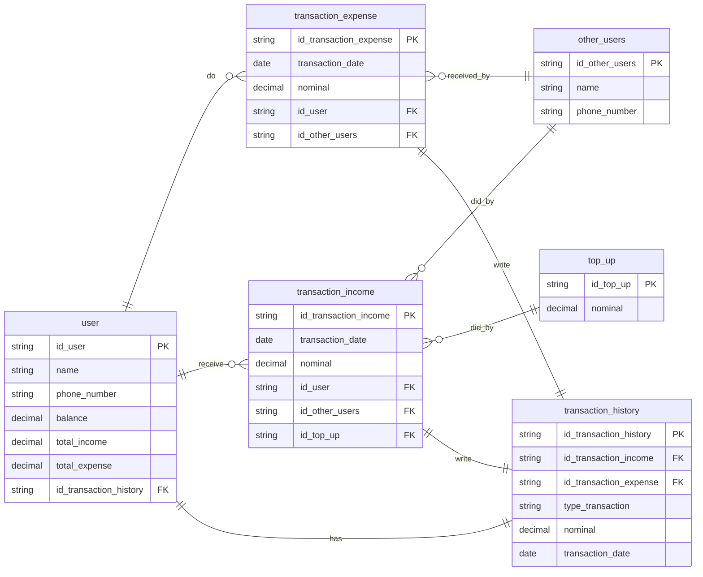

# E-Wallet - ERD

This project was made by Muhammad Davinda Rinaldy in Training Program held by Kodacademy to make ERD of an E-Wallet, using mermaid tool.

## Entity Relationship Diagram (ERD)

```mermaid
erDiagram
    direction LR
    user {
        string id_user PK
        string name
        string phone_number
        decimal balance
        decimal total_income
        decimal total_expense
        string id_transaction_history FK
    }
    transaction_expense {
        string id_transaction_expense PK
        date transaction_date
        decimal nominal
        string id_user FK
        string id_other_users FK
    }
    transaction_income {
        string id_transaction_income PK
        date transaction_date
        decimal nominal
        string id_user FK
        string id_other_users FK
        string id_top_up FK
    }
    other_users {
        string id_other_users PK
        string name
        string phone_number
    }
    transaction_history{
        string id_transaction_history PK
        string id_transaction_income FK
        string id_transaction_expense FK
        string type_transaction
        decimal nominal
        date transaction_date
    }
    top_up {
        string id_top_up PK
        decimal nominal
    }

    user ||--o{ transaction_expense : do
    user ||--o{ transaction_income : receive
    user ||--|| transaction_history : has
    transaction_income }o--|| other_users : did_by
    transaction_income }o--|| top_up : did_by
    transaction_income ||--|| transaction_history : write
    transaction_expense }o--|| other_users : received_by
    transaction_expense ||--|| transaction_history : write
```
